## Download sources:

- Visual Studio Code <br>
    [Download](https://code.visualstudio.com/download)

- Git <br>
    [Download (Windows)](https://git-scm.com/download/win)

- Extensions (optional) <br>
    [GitHub Pull Requests and Issues](https://marketplace.visualstudio.com/items?itemName=GitHub.vscode-pull-request-github) <br>
    [Git Blame](https://marketplace.visualstudio.com/items?itemName=waderyan.gitblame) <br>
    [Git Graph](https://marketplace.visualstudio.com/items?itemName=mhutchie.git-graph) <br>
    [Git History](https://marketplace.visualstudio.com/items?itemName=donjayamanne.githistory) <br>
    [.gitignore](https://marketplace.visualstudio.com/items?itemName=codezombiech.gitignore) <br>

# Setting up Git in Visual Studio Code

### 1. Enable Git
Go to `File` -> `Preferences` <br>
Go to `Settings` <br>
Type `Git: Enabled` in the search bar <br>
Make sure that the box is ticked <br>

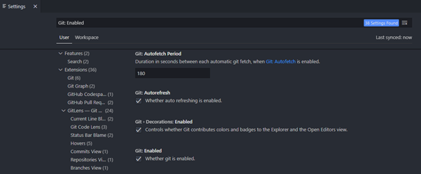

### 2. Configure your account details

Provide your `email`:
```
git config --global user.email "yourMail@example.com"
```

Provide your git `user name`:
```
git config --global user.name "your-name"
```

# Setting up your local project folder for a Java project (Windows)

### 1. Creating the root directory
Create the directory using `mkdir` and go into that directory using `cd`. 
```
mkdir testjava1
cd testjava1
```

### 2. Creating the subdirectories
Similar to the step above, create the subfolders called `src` and `bin`. 
Afterwards, change directory into the `src` subfolder. 
```
mkdir src
mkdir bin

cd src
```

### 3. Creating the subdirectories under `src` and `ie` (package)
Similar to the steps above, create the subfolders called `ie` and 
within `ie` create another subfolder called `tudublin`.
```
mkdir ie
cd ie

mkdir tudublin
```

### 4. Create a Java file within `testjava1/src/ie/tudublin`
Using file manager, go to the subfolder `tudublin`, right click
and choose `New` => `Text Document` and name it `Main.Java`. Your
file path should look like this: 

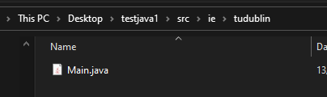

Alternatively, you can use the command prompt to create a file
within that folder.
```
cd tudublin
nul > Main.java
```

Also note that under the `View` tab in the menu bar, ensure that
`File name extensions` and `Hidden Items` are ticked.

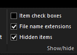


# Setting up your repository

### 1. Open the `Main.java` file with your chosen editor

### 2. Edit the `Main.java` file
```java
package ie.tudublin;


public class Main 
{
    public static void main(String[] args)
    {
        System.out.println("Every little cell in my body is happy");
    }
}
```

### 3. Open the root folder with Git Bash
Locate your root folder (in this case the `testjava1` folder) and right
click and then choose `Git Bash Here`, a window similar below
should pop up:

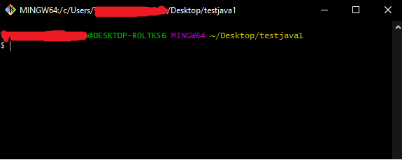

### 4. Setting up your root folder for your project

First, initalize empty Git repository locally.
```
git init
```

You will now notice under your root folder through file manager
that there is a new hidden folder called `.git`. This is where git will store all the previous snapshots of the previous versions your project. 


### 5. Set up your repository in GitHub
In your profile page, go to the `Repositories` tab and create a new repository by choosing `New`.

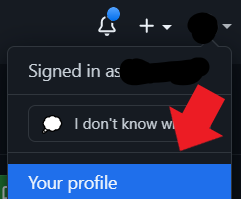

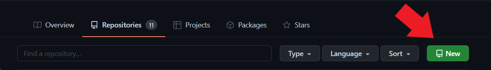

When creating the repository, the name will be the name of the folder that will get cloned, so it would make sense that it would match the name of your project folder in your local system. (However, you can call it whatever you like).

Then under the `Description`, it is highly recommended to type something in as this will be your `README.md` (markdown file).

You can choose whether to set this repository `Public` or `Private`. 

Then, select all options in the next section.

#### .gitignore
The purpose of the `.gitignore` is to hide selected files (untracked) when uploading to the github server. We would only want source codes to be uploaded. If we choose to not implement a .gitignore file, our repository size would be large and `merge conflicts`. In this case, choose the `Java` template in the dropdown menu.

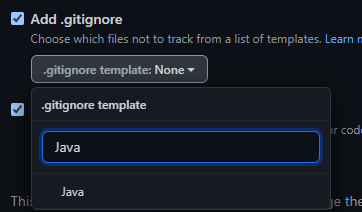

For <b>Java</b> projects, we would choose to hide `.class` files as they are the output of the build.

For <b>C</b> projects, we would choose to hide `.exe` files and `.obj` files.

#### License

Choose the `MIT licence` (permissive licence).

Your page should now look like this:

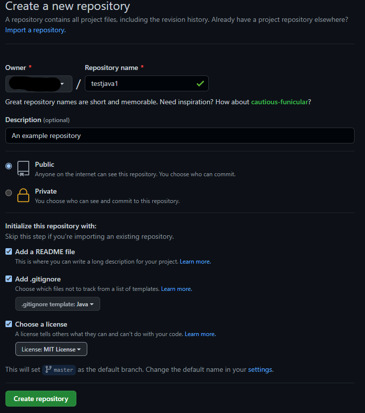

Choose `Create repository`:

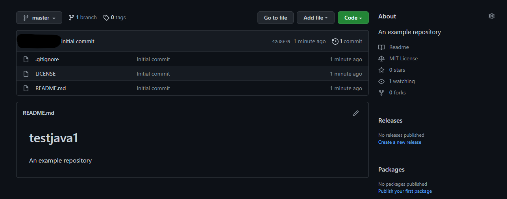


### 6. Create the link between your local repository and your repository in Github

Copy the link of your Github repository, it should look like this:
```
https://github.com/YOURGITUSERNAME/testjava1
```

Return to your Git bash and make sure the path you're currently in is the root folder of your project. Create link between your local repository and Github repository by inputting the line below (to paste in Windows, use right click):

```
git remote add origin https://github.com/YOURGITUSERNAME/testjava1
```

To check your remote repository in Git (repository that's hosted on the Internet or another network), type the following:
```
git remote -v
```

Then something like this should pop up:

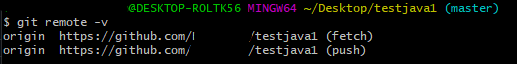

#### Default branch
Before heading on to the next step, it is important to check the `default branch` of your repository. In order to do so, go to your repository's settings then branches.

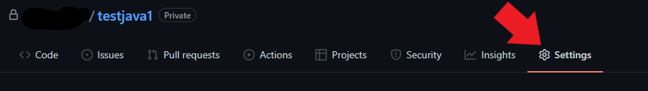
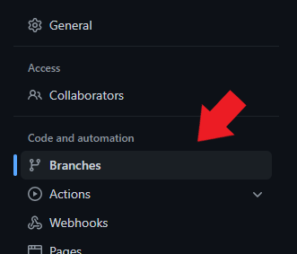

It should display the name of your `default branch` of your repository (either `master` or `main`).

### 7. Retrieve the files from your repository from the server (pull)

Before doing a commit on your local system, first retrieve the files created on your Github repository, in this case we expect to retrieve `.gitignore`, `LICENSE`, and `README.md`.

When running a `git pull` for the first time on your repositories, ensure to type in the following to associate the branch from your Github to your local system. Origin is the Github url alias.

If your default branch is called `master`:
```
git pull origin master
```

If your default branch is called `main`:
```
git pull origin main
```

This essentially means: Pull from the origin upstream, master/main branch, into my master/main branch.

#### If there is a .git in the end when doing `git remote -v`:
```
git remote set-url origin https://github.com/YOURGITUSERNAME/testjava1
```

# Git push

Open your project folder in Git Bash

### 1. Inital commit to your local repository

First add everything under the current directory to the `staging area` that is tracked (i.e., not in the `.gitignore` file).
```
git add .
```
The period `.` means everything under the current directory.

Then, `commit` everything that is under the `staging area` and save into the logs of commit.
```
git commit
```

Executing this will open up your editor and prompt for a `comment`. Once done, save the file and close it.

Alternatively, you can add your message in the command itself:
```
git commit -m "commit message"
```

To commit **all** changes:
```
git commit -a -m "commit message"
```


### 2. Send commits to the Github server

For first time commits (and also on new branches), associate your local branch to the branch from your server repository.
```
git push --set-upstream origin master
```

Thereafter, everytime a `push` is made, you can simply type the command like so:
```
git push
```

# More Git

### 1. Check status of repository

This essentially shows the changes of your repository.
```
git status
```

### 2. Resolving merge conflicts 
Merge a branch to the current branch (i.e., merge someBranch to master):

```
git checkout master
git merge someBranch
```

A merge conflict should look like this:
```
Auto-merging README.md
CONFLICT (content): Merge conflict in README.md
Automatic merge failed; fix conflicts and then commit the result.
```
Open the conflicted file in your chosen editor (in this case Visual Studio Code). You should see something similar to this:

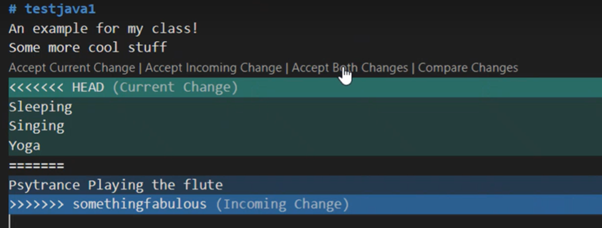

Choose which change to apply, save the file, then add the changes to the `staging area`, and commit changes.

### 3. Resolving merge conflicts involving binary files

If you wish to save the changes from a different branch:
```
git checkout --theirs test.bmp
```

If you wish to save the changes from your current branch:
```
git checkout --ours test.bmp
```

Then commit changes.

### 4. Git log

Show the log of all commits on your current branch:
```
git log
```

To `rollback` to a previous commit, select the 40 digit hexadecimal number by double clicking and pressing enter. Then, press `q` to exit the log and input the following (without the brackets):
```
git checkout <your40DigitHexadecimal>
```
This would rollback the system to that particular ccommit.

By doing this, you would now be in a `detached-head state`. Meaning no changes/edits will be saved. If you wish to keep the changes within this state, you would have to commit them into a new branch.

If you wish to go back to a branch, simply input: 
```
git checkout <branchName>
``` 

### 5. Git stash
 
Temporarily saves changes (like commits) into a list (aka `stash`) local to your system:
```
git stash
```

Give the stash a name:
```
git stash save <message>
```

View the list of changes:
```
git stash list
```

### 6. Git commit

Take most recent commit and add new staged changes:
```
git commit --ammend
```

Change most recent Git commit message:
```
git commit --amend -m "message here"
```

### 7. Git branch

To create a branch: 
```
git checkout -b <someBranch>
```
Every changes from there on will be saved on that branch. Remember to associate the local branch to the server branch on initial commits.

To return or change to a different branch:
```
git checkout <branchName>
```

To delete a branch:
```
git branch -d <branchName>
```

To force delete a branch:
```
git branch -D <branchName>
```

To check list of branches (local):
```
git branch
```

To check list of branches (remote):
```
git branch -r
```

### 8. Git clone and fork

To clone a repository to your local system:
```
git clone https://github.com/YOURGITUSERNAME/REPONAME
```

To set the upstream remote:
```
git remote add upstream https://github.com/ORIGINALGITUSER/REPONAME
```

Note that `origin` is the alias of your local repo, while `upstream` is the <b>original source</b> of the repo.

To update your local master branch to the upstream master branch:
```
git fetch
git checkout master
git pull upstream master
git push
```

### 9. Clear Git cache

```
git rm --cached <folderName>
```

### 10. Submodules

If your GitHub repository shows this icon:


Try
```
git add <folderName>
```

If results in an error such as:
```
xxx submodule xxx
```

Clear Git cache and try adding again


# References / Links

- [Cheat sheet](https://ndpsoftware.com/git-cheatsheet.html#loc=stash;)

- [Git document](https://git-scm.com/docs)